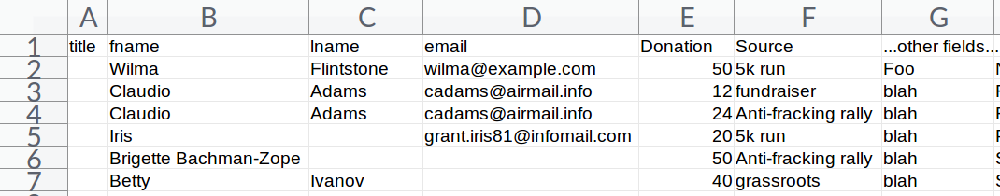
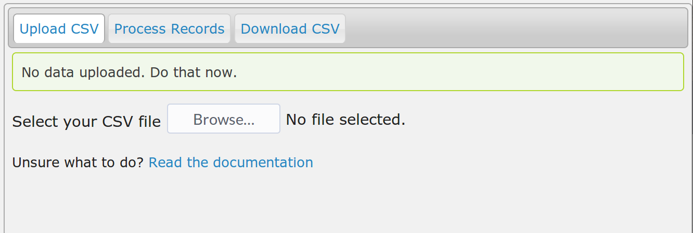
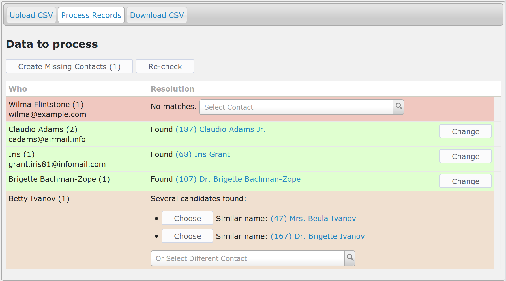
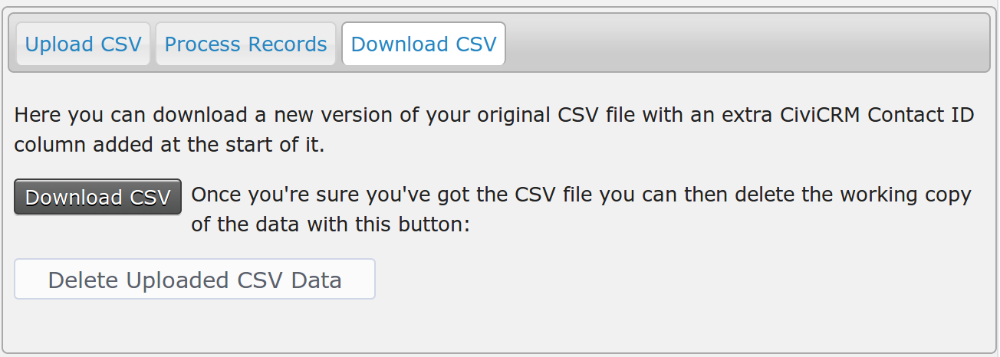
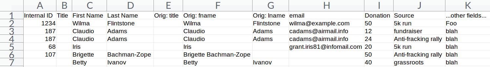

# Usage

It's pretty easy, but below is a worked example to get you feeling confident.
The steps are:

1. Do a little initial tweaking of your spreadsheet and save as CSV.

2. Upload your CSV spreadsheet and process it.

3. Download the new version with the matched contacts.

## Initial tweaking

You need to make the first four columns of your spreadsheet contain, in this
order:

1. Title
2. First name (can be the only name field)
3. Last name
4. Email

So you probably need to rearrange your spreadsheet columns a bit to fit. **Don't
worry if some of these are blank** - e.g. if you don't have titles, names or
emails for some rows. Obviously you'll need *something* in there, but it's fine
if your data just has emails, or just has names, for example.

Nb. If your data has a single "Name" column instead of separate first and last
names, stick that in column 2 (or "B" in spreadsheet-speak) - the one for first name.

### Example

This is an example dataset for the purposes of explaining how this works. Notes on this example data set:

1. The first row starts with the correct column order, as above, and continues
   with whatever data the file holds - beyond the first four columns doesn't
   matter. Also note that it doesn't matter what the exact text in the column
   headers are, here we have `fname` but it could say `first` or `First Name` or
   whatever.

2. Row 2, Wilma, is an example of someone not in the database.

3. Row 3, Claudio is in the database and this row and...

4. ...row 4 also belong to him.

5. Row 5, Iris is missing a last name but her email is in the database.

6. Row 6 has the whole name in the first name column.

7. Rob 7, betty: There's no match in the databse for her full name, but there
   are a few Ivanovs.

## Upload and process

You should find a new menu item **CiviCRM » Contacts » CSV Import Helper**,
click that.

Click Browse and find your CSV file. This should then automatically begin to be
uploaded (the status is displayed in the top right of the screen). Once
uploaded you should be moved to the Process Records tab.

### What's it showing?

The *Who* column shows the name and email from the uploaded data. It also shows
in brackets how many rows in the input data belong to that person. The second
column shows which contact matches in the database - this is linked to their
contact record so it's easy to check details if needed.

Of note:

1. *Wilma Flintstone* is listed as "No matches". We expected that, she's new to
   us.

2. *Claudio* has a `(2)` in the Who column because there are two rows in the input
   data that belong to him. This is a very useful feature if you have a lot of
   records relating to the same person! He has been located as an existing
   contact and the name from CiviCRM is shown in the Resolution column. The
   resolution column also has `(187)` which is that contact's CiviCRM internal
   contact ID.

3. *Iris* has been identified (by her email) as one Iris Grant.

4. *Brigette* has been identified, too. The extension was able to separate out her
   first and last names OK.

5. *Betty* was not uniqely identified, but it found several other contacts with
   the same last name. Nb. if it finds more than 10 'similar' contacts it just
   says so because it would be unhelpful to list every person just because they
   have a popular last name.

### What to do now?

The aim of the game is to turn all rows green! Join in, it's fun!

### "No matches"

Either you want to add a new person into your database, or you need to help the
extension find the right person yourself. For the second case (sometimes you
know something the database does not, like a change of name, or a different
email address) you can select a contact using the *Select Contact* widget.

Otherwise you can use the *Create Missing Contacts* button which will create new
Individuals (no, you can't use this for Organisations) for all the rows that say
*No Matches*, in this case just one. Typically you'd leave pressing that button
until you had checked the whole dataset.

### "Found"

Job done! However, if you think the extension got it wrong you can click the
*Change* button which will allow you to select a different contact (or leave it
unmatched).

### "Several candidates found"

If one of the ones listed is right you can click the *Choose* button. Otherwise
you can use the *Select Contact* widget to find the person yourself.

### What else?

If you've selected a contact you can "Reset" this decision and choose a
different one with the *Reset* button that appears once you've made a choice.

### What does the Re-check button do?

Sometimes while working with import data you notice things about your existing
data and make updates. e.g. you might choose to merge two duplicate contacts.
This will mess up the guesses in the *Resolutions* column as the exension won't know that
you've done this and could still be offering contacts that don't exist any more!
Di-sa-ster, darling. That's what the *Re-check* button is for. It will look for
matches for all rows that aren't selected (green).

### Do I *have to* make it all green?

Nope. If you don't select a contact then when you download the output
spreadsheet it will just have a blank in the Internal ID column.

## Download the new CSV file!

Finally you can visit the *Download* tab:

There's two buttons:

1. *Download CSV* - get your new file

2. *Delete Uploaded CSV data* - deletes the copy of data you uploaded. You should
   always do this after you've successfully downloaded the matched data.

### The outputted spreadsheet

1. It has the Internal ID from CiviCRM as the first column.

2. The title, first, last name columns are sort of duplicated with the original
   columns following. This is a bit weird, but it's useful to see (and possibly
   fix) how the extension has separated out names, e.g. Brigette.

3. The rest of the columns should be exactly as they were.

You can then import that using CiviCRM's built-in import tools, the use of which
is out of scope for this documentation.

Enjoy!

Rich Lott / [Artful Robot](https://artfulrobot.uk)
